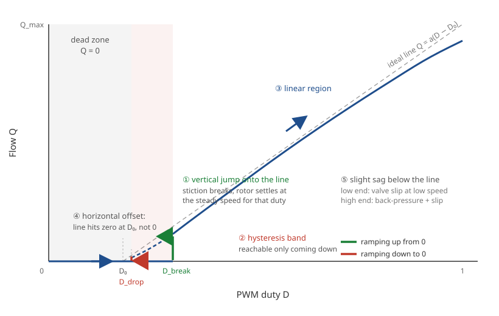

# Pumps and PWM

## Why two pumps

A chamber's humidity, given time to settle at constant temperature, is the
flow-weighted mean of what comes in:

$$H = \frac{Q_\mathrm{wet} H_\mathrm{wet} + Q_\mathrm{dry} H_\mathrm{dry}}{Q_\mathrm{wet} + Q_\mathrm{dry}}$$

With the supply humidities roughly constant, the humidity is a function of
the two flows alone, and one number captures it -- the blend
$h = (Q_\mathrm{wet} - Q_\mathrm{dry}) / (Q_\mathrm{wet} + Q_\mathrm{dry})$, so that
$H = h\,(H_\mathrm{wet} - H_\mathrm{dry}) + H_\mathrm{dry}$. That is what the
[blender device](../3-devices/blender.md) computes: one humidity demand
becomes two flows at a chosen total. Valves, a humidifier and a
dehumidifier, or single-speed pumps switched on and off would all do the
same job; two variable-speed DC pumps were chosen because they are cheap,
quiet, long-lived (no on/off cycling) and simple to drive.

## How a duty becomes a flow

A DC motor's speed is close to linear in the voltage across it, and a PWM
signal at a few kilohertz gives it an average voltage of duty × supply --
50 % of 6 V is 3 V. So a pump's flow is close to linear in duty, but not
from zero:

- **Dead zone.** Below some duty $D_0$ the motor cannot overcome its load
  and the pump does not turn: flow is zero, not small.
- **Stiction and hysteresis.** Starting from rest needs more than keeping
  going: ramping up, the pump breaks free at $D_\mathrm{break}$ and jumps
  onto the line; ramping down it keeps turning below that, to $D_\mathrm{drop}$.
  The band between is reachable only coming down.
- **The linear region** above, $Q = a\,(D - D_0)$, with a slight sag at the
  low end (valve slip at low speed) and the high end (back-pressure and
  slip).

The software models this with two numbers per pump in `rig-multi-sensor.yaml`:
`deadband` (the duty below which the pump is treated as off, and the offset
the linear map starts from) and `max_flow` (the flow at full duty, L/min),
so a flow demand maps onto the usable part of the line and a demand below
the dead zone is a clean stop rather than a stalled motor. Measure both for
your pumps -- flow against duty, up and then down -- and put the numbers in;
[Limits](../1-running/limits.md) says what follows from them.

## The motor driver

A GPIO pin cannot source a motor: something must switch the pump supply
from the Pi's 3.3 V logic. A relay would do for on/off pumps but is loud
and wears; for PWM it has to be a transistor bridge that switches fast
enough, drops little voltage, and takes 3.3 V logic. The TB6612FNG dual
H-bridge does all three for two motors on one board, with the flyback
protection built in; [Board and wiring](board.md) has the pin-out. The
things to check for a different pump: its voltage and running / starting
current against the driver's ratings, and that the driver's own voltage
drop still leaves the pump its full speed at 100 % duty.
